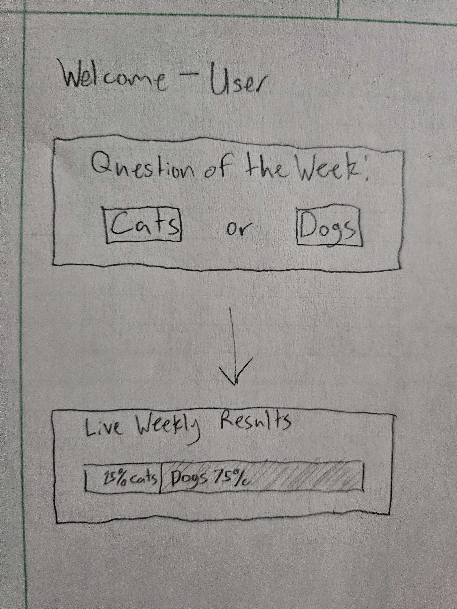
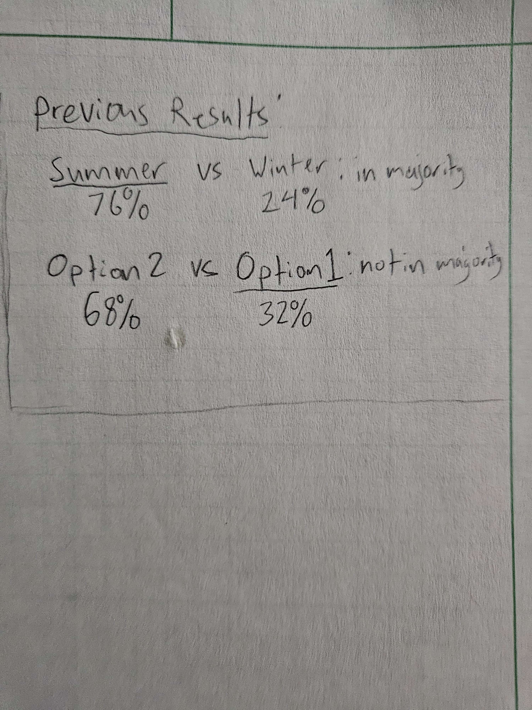

# Head To Head
## Elevator Pitch
Dogs vs Cats, Batman vs Superman, BYU vs Utah. There are many famous rivalries throughout history. Head To Head is a weekly social poll that pits two rivals against each other and polls users to see who comes out on top. Each week you will be able to vote on which side should win and be able to see the percentages change live.

## Design

This is the poller before and after the user has voted for the week.

This is what the previous results look like, the underlined choice is what the user voted for.

## Key Features

- User login over HTTPS
- Ability to vote on the poll
- Poll that changes weekly 
- History of previous polls and how user voted
- Live results of current poll after user has vote
- Database to store poll results and users votes

## Technologies

- **Authentication** - User will be able to create and log into an account. User will only be able to vote while logged in.
- **Database data** - Poll results for current and past polls are stored in a database as well as login credentials.
- **WebSocket data** - The current poll results will be displayed live as other users vote on the poll.

## HTML Deliverables
- **HTML Pages** - Added 3 HTML pages for Login, Voting, and Previous Results.
- **Links** - Have 3 links at the top of each page, the links to vote will not be accessible unless logged in.
- **Text** - All of the votes will be represented with text as well as previous voting results on prev.html.
- **3rd Party Service** - Will call a third party service to make a bar that is a part blue, part red for each result
- **Images** - Has an image for each current voting option.
- **Login** - Input box and submit button for username and password to login.
- **Database** - Previous votes will be data pulled from the database.
- **WebSocket** - As voting happens, the current percentage will be presented.

## CSS Deliverables
- **Header, footer, and main content body**
- **Navigation elements** - Stylized the navigation elements
- **Resizing elements** - all pages respond well to resizing
- **Application elements** - made a piechart for current results and made the voting page make visual sense
- **Application text content** - Changed the font and font colors to make sense with the background of each page
- **Application images** - made the images size to the voter button so that the buttons remains in consistant size and alignment

## JS Deliverables
- **Login** - Set up login to be saved for future use
- **Database** - Displays the voting count and current users active 
- **Websocket** - Added local variables representing future websocket updates from other users votes.
- **Application Logic** - Added logic to vote page that votes when either option is clicked and updates user current vote count as well as the pie chart.

## Service deliverable
- **Node.js/Express HTTP service** - done
- **Frontend served using express static middleware** - done
- **Call to third party service endpoint** - gets random quotes on login page
- **Backend Service Endpoints** - placeholders for login and endpoints for updating votes
- **Frontend calls service endpoints** - Gets votes using fetch.

## DB deliverable
- **MongoDB Atlas database created** - done
- **Endpoints for data** - stubbed out endpoints for processing data and send it to mongo.
- **Stored data in MongoDB** - done!

## Login deliverables
- **User registration** - done
- **Existing user** - done
- **Use Mongodb to store creds** - done
- **Restricts functionality** - done

## Websockets
- **Backend listens for WebSocket connection** - done !
- **Frontend makes WebSocket connection** - done !
- **Data sent over WebSocket connection** - done!
- **WebSocket data displayed** - Piechart updates to clicks in real time!

## React
- **Bundled using WebPack and Babel** - done !
- **Components** - Login, Vote count, and Quote are all react components
- **React Router** - Routing between pages handled by router
- **Hooks** - Hooks used by Quote, red voting, and blue voting
